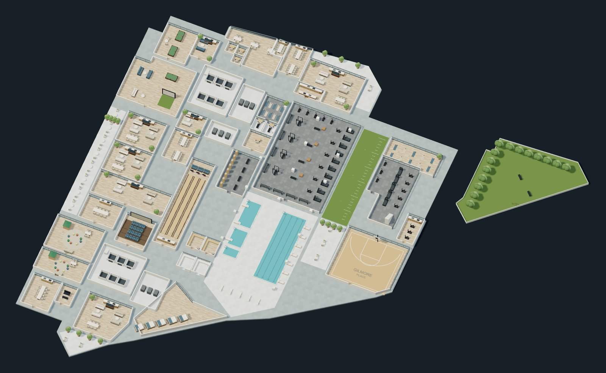
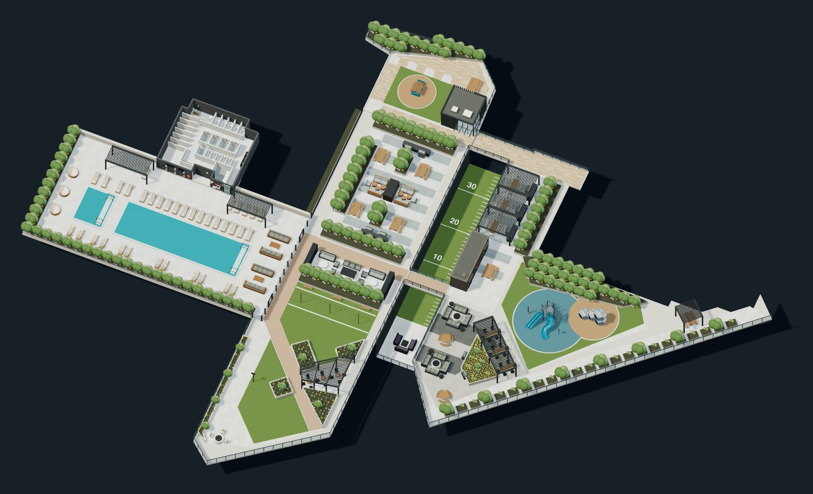

# Club Gilmore — interactive amenity model

A standalone, roofless 3D explorer for the Club Gilmore amenity floors. Two floors share one viewer: **Level 4** indoors and **Level 6** outdoors. Rooms are selectable from the model or from the list, with category and search filters, photo references, plan and 3D views, adjustable cutaway walls and GLB export.

Use **L4 / L6** in the header to switch floors. Deep links work: `/?level=6` opens Level 6, `/#L6-play` opens it with a space already selected.

## Level 4 — indoor amenities



46 traced zones, 45 of them browsable — a support-office zone is modelled but filtered out of the public list. Gym and cardio, indoor pools, bowling lanes, sports court, games and golf lounges, study centre and booths, event suites, private dining and catering kitchen, children's playroom, and the outdoor dog park.

Zones are polygons in *trace units*: pixel coordinates read off the rendered 1824 px-wide architectural plan, converted at `METRES_PER_TRACE_UNIT = 8.8392 / 138`, where a 29 ft grid bay measures 138 px. Walls are modelled at a uniform 3 m and displayed at 1.1 m for the default cutaway; the wall-height control scales them in place.

## Level 6 — outdoor amenity deck



13 selectable outdoor zones: the outdoor pool and hot tub, sun deck and change rooms, bocce lawn, two fireplace lounges, the fire pit terrace, east BBQ terrace, south garden, north terrace and playhouse, children's play area and urban garden plots. The two light wells look down onto Level 4, including the numbered turf field.

Level 6 has **no measured drawing**. Its coordinates are normalised to a supplied 1855 × 1344 overhead render at `U = 0.065` m per unit, so scale, heights and dimensions are approximate — which is why the metre scale bar is hidden on this floor. Level 4's confirmed 20 m pool does not transfer.

## Run it locally

```sh
npm install
npm run dev      # vite dev server, fixed at http://127.0.0.1:4173
```

Drag to orbit, right-drag to pan, scroll or pinch to zoom. Keyboard users can select from the room list and use the view buttons; arrow keys pan when the canvas has focus. Below 760 px the viewer shows either the room browser or the detail sheet, never both, and touch targets stay at 44 px minimum.

## How it is built

Single-page Vite + Three.js, no framework. `index.html` owns the entire DOM and `main.js` only fills existing elements by id — it never creates panels.

The camera is orthographic with OrbitControls and renders **on demand**: `requestRender()` sets a flag and there is no continuous animation loop, so anything that changes the scene has to ask for a frame. Camera moves go through `frameBounds()`, which projects corner points onto the camera basis to compute a fitting zoom, then either snaps (instant, or when `prefers-reduced-motion` is set) or drives a manual tween stepped inside `render()`.

Both floors are built procedurally. Textures come from 2D-canvas draws over a seeded RNG; furniture is assembled from `box` / `cyl` / `rod` primitives. Each floor is cached in a `models` map on first build, so switching back is instant.

`window.clubGilmore` is the read-only surface the Playwright scripts drive. `ready` is their load gate; `model`, `rooms` and `activeLevel` are getters, because switching floors reassigns them.

## Model fidelity and evidence

Room boundaries are manually traced approximations, not a CAD or BIM conversion. Finishes and furnishings are representative interpretations of supplied photographs, and some photo links show similar rather than identical spaces — the interface calls them photo references throughout.

Corrections are ranked, most authoritative first:

1. an explicit user confirmation or annotation
2. actual site photographs (`public/photos/site-*.jpg`)
3. the supplied marketing render
4. inference

Later corrections supersede earlier ones, and `MODEL-SOURCES.md` records the whole chain rather than rewriting it — the Level 4 20 m pool overriding a drawing label, and the Level 6 aerial photographs overriding the render, are both worked examples. It also records what could **not** be resolved: the floor plan and the marketing render are not a similarity transform of each other, so plan pixel lengths cannot be converted to trace units and only their parallel, perpendicular and straight-edge relationships are used.

## Verification

A dev or preview server must already be running on port 4173.

```sh
node scripts/verify-level6.cjs   # Level 6 + floor switching -> evidence/level6-*.png, level6-verification.json
node scripts/verify.cjs          # Level 4 suite -> evidence/verification.json
node scripts/inspect.cjs         # Level 4 screenshots + performance stats -> evidence/
```

There is no test framework; each script is a single `node:assert/strict` file. `verify-level6.cjs` runs as-is on macOS and takes `PLAYWRIGHT_PATH` and `CHROME_PATH` overrides. **`verify.cjs` and `inspect.cjs` still hardcode Windows paths** and will fail until edited — copy the env-override pattern from `verify-level6.cjs`. Note that `verify.cjs` also overwrites the root `Club-Gilmore-Level-4.glb` with a freshly exported model.

`QA.md` is the validation record. It marks edits as "pending validation" wherever a render was never actually captured; a visual PASS is only ever claimed for a browser run that produced it. The model has not been dimension-audited room by room, tested on physical phones, or connected to a booking account.

## Files

| Path | Purpose |
| --- | --- |
| `src/rooms.js` | Level 4 room identity, floor polygons, categories, photo references, booking URL |
| `src/model.js` | Level 4 geometry and materials; also the shared primitive library Level 6 imports |
| `src/level6.js` | Level 6 deck model, rooms and labels |
| `src/playground.js` | Level 6 play equipment, split out only because the geometry is large |
| `src/changeRoom.js` | Level 6 change-room shell, interior fit-out and pool-facing elevation |
| `src/main.js` | Camera, selection, browsing, level switching, photography, GLB export |
| `index.html`, `src/style.css` | Responsive viewer interface |
| `public/photos` | Resized derivatives of supplied photographs; originals untouched |
| `public/references` | Original floor plan and marketing render, linked from the Level 6 browser |
| `docs` | Floor renders used above |
| `evidence` | Browser screenshots and validation results |

`MODEL-SOURCES.md` records every geometry assumption with its evidence, `DESIGN.md` is the frozen design system, `QA.md` the validation record and `SURFACE.md` the direction contract.

## Booking integration seam

Booking is intentionally unwired. Selection emits `club-gilmore:room-selected` on `window` with `{roomId, name, bookingUrl}` — a local event, not a cross-origin iframe bridge.

To connect a room later, set its `bookingUrl` to a confirmed HTTPS destination. Null URLs render the explicit unconnected state. **Do not infer provider resource IDs from architectural room IDs.** Room IDs are stable public identifiers: rename a room's `name` freely, but keep its id. The provider remains responsible for availability, authentication and reservations; none of that is implemented here.

## Build and deployment

```sh
npm run build
npm run preview   # serves dist/ on the same 127.0.0.1:4173
```

`dist` is the static web build. Serve it over HTTP(S) — opening `index.html` through `file://` is unsupported.

`Club-Gilmore-Level-4.glb` in the repo root is an exported model in metres, with textures and room identifiers. It was reopened with GLTFLoader and its main pool measured 20 m. The saved file uses the default lowered-wall view, while the viewer's **Download model** button exports the currently displayed wall height for the active floor. Open the GLB in any compatible 3D application to inspect or refine the geometry; the HTML room and photo interface is a separate web application.

This custom WebGL surface exists because the brief needs genuinely orbitable geometry, raycast room selection and GLB export. It can later be hosted and embedded alongside the native YCode site. No YCode layers or published site were changed, and embedding has not been tested. The source architectural PDFs live outside this app and are not copied into the production build.
